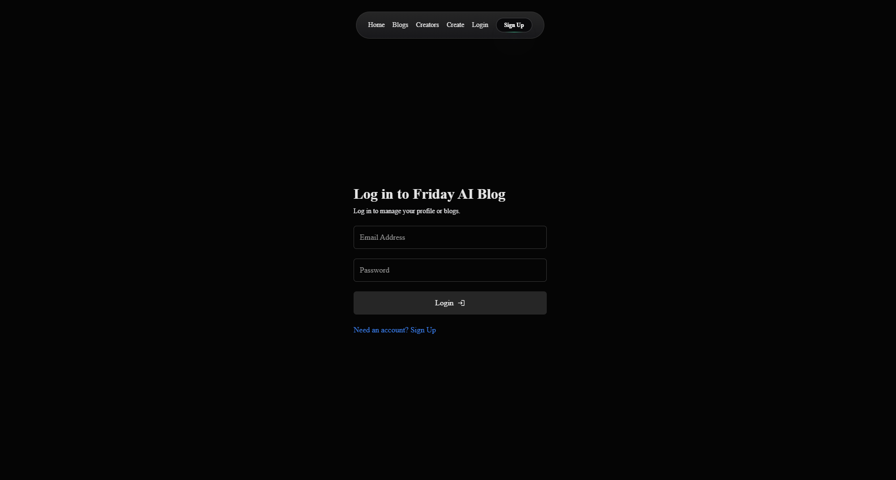

Certainly! Here's the modified README with sensitive environmental variable details removed:

---

# Blog-Tech

This project consists of a frontend and backend for a blog application built using React, Express, and MongoDB.

## Frontend

The frontend is built using React and utilizes various libraries for UI components and state management.

### Prerequisites

- Node.js (v14 or higher)
- npm (v6 or higher)

### Installation

1. Clone the repository:
   ```bash
   git clone <repository_url>
   ```

2. Navigate to the frontend directory:
   ```bash
   cd frontend
   ```

3. Install dependencies:
   ```bash
   npm install
   ```

### Development

To run the development server:
```bash
npm run dev
```

This will start the development server using Vite.

### Production Build

To create a production build:
```bash
npm run build
```

## Backend

The backend is built using Express.js and MongoDB for database operations.

### Prerequisites

- Node.js (v14 or higher)
- MongoDB (ensure MongoDB is installed and running)

### Installation

1. Navigate to the backend directory:
   ```bash
   cd backend
   ```

2. Install dependencies:
   ```bash
   npm install
   ```

### Development

To run the development server with nodemon:
```bash
npm run dev
```

This will start the backend server with nodemon for automatic restarts on file changes.

### Production

To start the backend server in production mode:
```bash
npm start
```

### Environment Variables

Ensure you have a `.env` file in the backend directory with the required variables.

## Images



